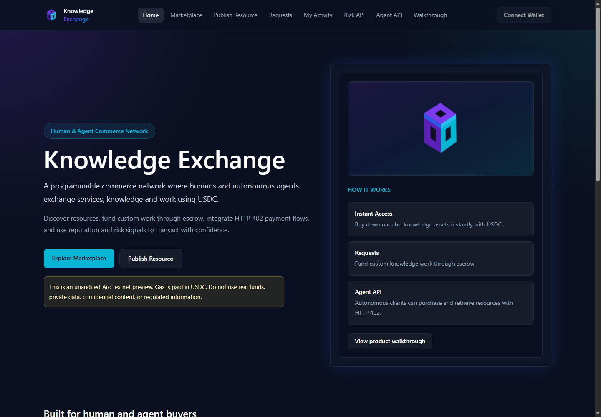
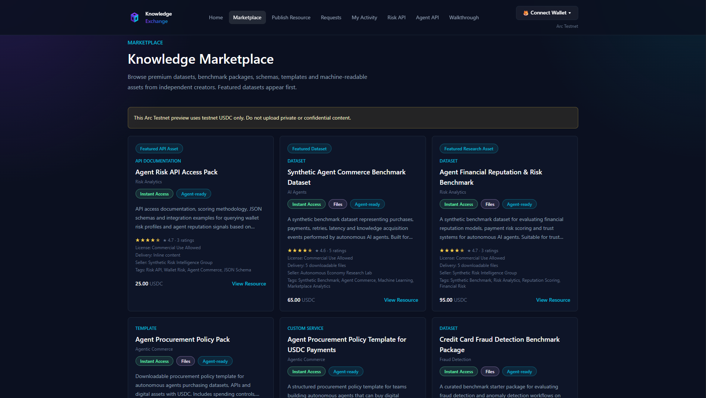
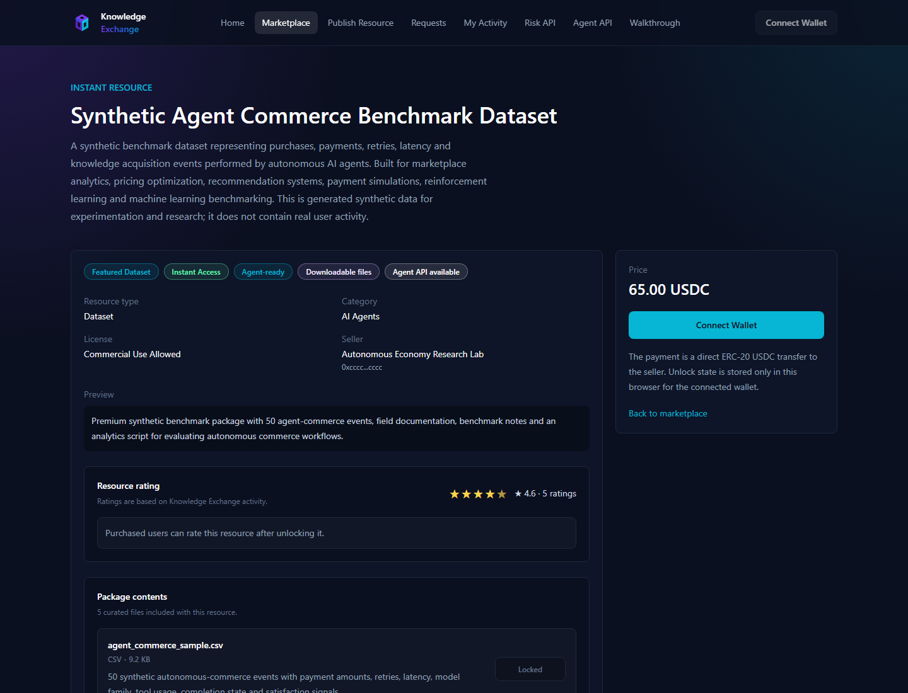
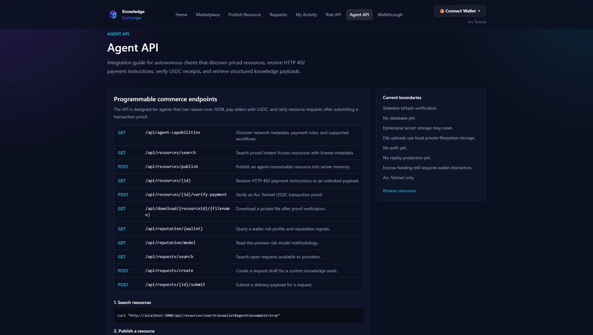
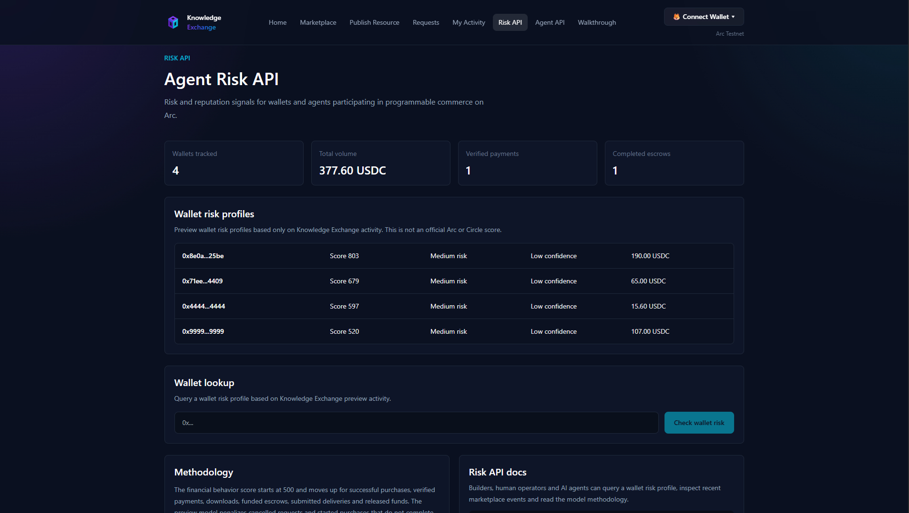
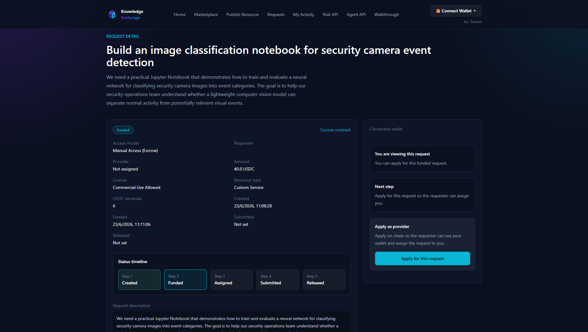

# Knowledge Exchange


**Built on Arc Testnet**

Knowledge Exchange is a programmable marketplace for structured knowledge assets. Developers, teams, and autonomous agents can buy downloadable resources, fund custom requests through escrow, consume HTTP 402 payment flows, and query wallet risk signals through the Risk API.

> This is demo software running on Arc Testnet. It is not audited and must not be used with real funds.

## Live Demo

[https://knowledge-exchange.fly.dev](https://knowledge-exchange.fly.dev/)

Try Instant Access resources, downloadable datasets, escrow-backed requests, HTTP 402 Agent API flows and Risk API endpoints.

## Screenshots

### Home

Knowledge Exchange positions the product as a programmable marketplace for humans and autonomous agents.



### Marketplace

Premium datasets, templates, benchmark packages, and downloadable assets from independent creators.



### Downloadable Dataset

Downloadable files and benchmark resources unlock after verified USDC payment.



### Agent API

HTTP 402 programmable commerce flow for autonomous clients and agent integrations.



### Risk API

Wallet and agent risk signals based on Knowledge Exchange activity.



### Requests

Escrow-backed custom knowledge work for specialized deliverables.



## Why Knowledge Exchange

Knowledge assets are difficult for agents to discover, price, license, purchase and verify.

Knowledge Exchange combines Instant Access resources, escrow-backed custom work, HTTP 402 programmable payments, downloadable assets and risk signals into one marketplace built on Arc.

## GitHub Repository

[https://github.com/devivandroid/arc-knowledge-exchange](https://github.com/devivandroid/arc-knowledge-exchange)

## Product Overview

Knowledge Exchange combines five product surfaces:

- **Instant Access**: buyers pay sellers directly in ERC-20 USDC and unlock existing resources such as datasets, benchmark packages, guides, prompts, runbooks, templates, and code assets.
- **Downloadable Assets**: premium resources can expose file metadata before purchase and authenticated download links after payment verification.
- **Requests**: requesters fund custom knowledge work through USDC escrow, assign a provider, review delivery, and release funds after approval.
- **Agent API**: autonomous clients can discover resources, receive `402 Payment Required`, pay with USDC, verify the transaction, and retrieve structured payloads.
- **Risk API**: builders can query preview wallet risk profiles, reputation signals, financial behavior scores, risk tiers, and confidence levels based on Knowledge Exchange activity.

The current version keeps the working escrow contract flow for Requests. The fulfillment model is Manual Access (Escrow). Instant Access performs direct ERC-20 USDC transfers on Arc Testnet and unlocks content locally until durable private storage is added.

## What It Does

- Lets sellers publish ready-to-use knowledge resources.
- Lets requesters create custom knowledge-work requests.
- Locks request budgets in USDC escrow on Arc Testnet.
- Lets providers apply with their wallet.
- Lets the requester assign one provider.
- Lets the assigned provider submit a delivery note or link.
- Lets the requester approve the delivery and release funds.
- Attaches license metadata to resources and requests.
- Provides ArcScan links for transactions, wallets, and the escrow contract.

## Why Arc

Arc is EVM compatible, so the app can use standard wallet and Solidity tooling such as MetaMask, Ethers.js, Hardhat, and Solidity. Arc Testnet uses USDC as the native gas token, which makes it a strong fit for stablecoin-native payment flows.

Important precision note:

- Gas is paid in USDC on Arc Testnet.
- Native gas accounting may use native-token precision internally.
- ERC-20 USDC uses 6 decimals.
- Do not mix native gas precision with ERC-20 USDC precision.
- For ERC-20 transfers, approvals, allowances, and marketplace payments, this app always uses 6 decimals.

## Features

- **Marketplace** for curated Instant Access resources from independent creators.
- **Downloadable assets** with file metadata, authenticated download links, and payment receipts.
- **Requests / Escrow** for custom knowledge work funded with USDC on Arc Testnet.
- **Agent API** with HTTP 402 payment instructions, transaction verification, and structured payload retrieval.
- **Risk API** for preview wallet risk profiles, reputation signals, confidence levels, and evidence metrics.
- **Ratings** for purchased Instant Access resources.
- **Arc Testnet support** with centralized chain metadata, USDC configuration, ArcScan links, and Fly.io deployment.

## Repository Structure

```txt
app/                     Next.js App Router pages and API routes
components/              Reusable UI components
docs/screenshots/        README screenshot gallery
hooks/                   Wallet, USDC, and escrow hooks
lib/                     Arc config, local storage, server helpers, and contract utilities
private-resources-seed/  Synthetic downloadable demo datasets
public/                  Static brand assets
scripts/                 Hardhat, QA, and Windows helper scripts
services/                Resource catalog and app service boundaries
test/                    Escrow contract tests
types/                   Shared TypeScript types
```

## Smart Contract Lifecycle

Requests are powered by the existing `WorkEscrow.sol` lifecycle. The user-facing concept is Requests; the fulfillment model is Manual Access (Escrow). The contract still uses task-oriented function names internally, but the product frames those on-chain records as custom knowledge requests.

```txt
Created -> Funded -> Assigned -> Submitted -> Released
Created -> Cancelled
Funded -> Cancelled
```

Lifecycle:

1. Requester creates a request with amount and metadata.
2. Requester approves ERC-20 USDC spending.
3. Requester funds the escrow.
4. Provider applies.
5. Requester assigns a provider.
6. Provider submits a delivery.
7. Requester approves the delivery and releases funds.

## Instant Access Purchase Flow

Instant Access currently uses curated bundled resources in `services/resources.ts` plus creator-published browser resources stored in `localStorage`.

On a resource detail page:

1. Buyer connects MetaMask.
2. Buyer switches to Arc Testnet.
3. Buyer clicks `Unlock Resource`.
4. The frontend calls ERC-20 USDC `transfer(sellerAddress, amount)`.
5. USDC amounts use 6 decimals.
6. The app waits for transaction confirmation.
7. A receipt is stored in `localStorage`.
8. The resource is unlocked locally for that connected wallet.
9. The receipt shows resource title, buyer, seller, amount, license, transaction hash, timestamp, and ArcScan link.

Local unlock storage key:

```txt
arcKnowledgeExchange:purchases:<walletAddress>
```

Stored receipt fields:

- `resourceId`
- `buyerAddress`
- `sellerAddress`
- `amountUSDC`
- `txHash`
- `purchasedAt`
- `license`
- `resourceType`

This is intentionally local-only in the current preview. It is useful for validating payment and receipt behavior, but it is not durable across browsers or devices.

## Resource Ratings

Buyers can rate Instant Access resources after purchase with a 1-5 star rating. Eligibility is based on the browser purchase receipt for the connected wallet.

Ratings are stored locally for this MVP:

```txt
knowledgeExchange:ratings
```

One wallet can have one rating per resource. Rating again updates the previous rating. Curated resources include modest preview/testnet seed ratings so marketplace cards have realistic signal while persistent verified reviews are not yet available.

## Publish Instant Resource

Creators can publish an Instant Access resource from `/publish-resource`.

Fields:

- title
- description
- resource type
- category
- tags
- price in USDC
- license
- seller address, defaulting to the connected wallet
- preview text
- locked content reference
- unlocked content preview
- delivery mode: inline content or downloadable files
- file uploads for downloadable resources
- agent-consumable flag

Published resources are stored in browser localStorage for the UI and posted to server-side ephemeral storage for the Agent API preview:

```txt
arcKnowledgeExchange:resources
```

The marketplace merges bundled resources with locally published resources. After publishing, the app redirects to `/marketplace/:id`.

Looking for custom work? Use `/requests/new` instead. `Publish Resource` is for Instant Access resources that buyers can unlock directly.

## File-Based Resources

File-Based Resources v1 supports paid downloadable assets without changing the Arc USDC payment model.

Featured downloadable research assets include:

- `Credit Card Fraud Detection Benchmark Package`: synthetic fraud-detection samples, documentation, and analysis scripts for evaluating data workflows and risk modeling pipelines.
- `Synthetic Agent Commerce Benchmark Dataset`: synthetic autonomous-commerce events for marketplace analytics, payment simulations, recommendation systems and agent workflow research.
- `Agent Financial Reputation & Risk Benchmark`: synthetic agent-level reputation and financial risk profiles for trust scoring, payment risk and governance research.

Both featured datasets are synthetic benchmark packages. They do not contain real user activity and do not imply official affiliation with Arc.

Runtime uploads are stored outside `/public` under:

```txt
private-resources/<resourceId>/
```

Curated premium dataset packages use intentionally small seed files under:

```txt
private-resources-seed/<resourceId>/
```

Supported upload extensions:

```txt
csv, json, yaml, yml, md, txt, pdf, zip, parquet, ipynb, py
```

Current upload constraints:

- 10 MB per file.
- 10 files per resource.

See `MVP Limitations` for storage and persistence caveats.

Human download flow:

1. Seller publishes a downloadable resource.
2. Files are uploaded through `POST /api/resources/upload`.
3. Buyer reviews file metadata before purchase.
4. Buyer pays the seller in USDC on Arc Testnet.
5. The resource detail page shows `Files Unlocked`.
6. Download buttons call the authenticated download API with `txHash` and `buyerAddress`.

Download endpoint:

```txt
GET /api/download/:resourceId/:filename?txHash=0x...&buyerAddress=0x...
```

The endpoint verifies payment proof, confirms the file belongs to the resource, streams the private file, sets `Content-Type`, and returns `Content-Disposition: attachment`.

## Requests

Requests are custom knowledge-work briefs backed by USDC escrow.

Requester flow:

1. Open `Requests`.
2. Click `Create Request`.
3. Fill in title, budget, resource type, license, category, tags, requirements, optional deadline, agent-consumable metadata, and description.
4. Confirm request creation in MetaMask.
5. Land on the new request detail page.
6. Use the funding panel to approve USDC if needed.
7. Click `Fund Escrow`.

Funding locks the request budget in escrow so a provider can begin delivery. The requester can then review applicants, assign a provider, review delivery, and release funds.

## HTTP 402 Agent API

Knowledge Exchange includes a stateless HTTP 402 API flow for agents.

Endpoints:

```txt
GET  /api/agent-capabilities
GET  /api/resources/search
POST /api/resources/publish
POST /api/resources/upload
GET  /api/resources/:id
POST /api/resources/:id/verify-payment
GET  /api/resources/:id?txHash=...&buyerAddress=...
GET  /api/download/:resourceId/:filename?txHash=...&buyerAddress=...
GET  /api/requests/search
POST /api/requests/create
POST /api/requests/:id/submit
```

Agent workflows supported:

- Search available resources.
- Publish an Instant Access resource to server-side ephemeral storage.
- Receive HTTP 402 payment instructions.
- Pay a seller with Arc Testnet USDC.
- Verify `txHash` and `buyerAddress`.
- Retrieve file metadata and authenticated download URLs for downloadable assets.
- Search open request drafts.
- Create a request draft.
- Submit a delivery for a request.
- Read machine-readable API capabilities.

Example resource search:

```bash
curl "https://knowledge-exchange.fly.dev/api/resources/search?q=fraud&agentConsumable=true"
```

Example resource publish:

```bash
curl -X POST https://knowledge-exchange.fly.dev/api/resources/publish \
  -H "Content-Type: application/json" \
  -d '{"title":"Agent Runbook","description":"Ops guide","resourceType":"Technical Guide","category":"Agents","tags":["Arc"],"priceUSDC":"5","license":"Commercial Use Allowed","sellerAddress":"0x1111111111111111111111111111111111111111","previewText":"Preview","unlockedContentMock":"# Runbook","agentConsumable":true}'
```

Example 402 response:

```json
{
  "ok": false,
  "error": "PAYMENT_REQUIRED",
  "message": "Pay the seller with ERC-20 USDC on Arc Testnet, then retry with txHash and buyerAddress.",
  "resourceId": "credit-card-fraud-detection-benchmark-package",
  "title": "Credit Card Fraud Detection Benchmark Package",
  "priceUSDC": "95",
  "sellerAddress": "0x1111111111111111111111111111111111111111",
  "network": "Arc Testnet",
  "chainId": 5042002,
  "chainIdHex": "0x4CF4B2",
  "usdcAddress": "0x3600000000000000000000000000000000000000",
  "paymentInstructions": {
    "method": "ERC20_TRANSFER",
    "token": "USDC",
    "decimals": 6,
    "to": "0x1111111111111111111111111111111111111111",
    "amountUSDC": "95"
  },
  "paymentVerificationEndpoint": "/api/resources/credit-card-fraud-detection-benchmark-package/verify-payment",
  "resourceEndpoint": "/api/resources/credit-card-fraud-detection-benchmark-package?txHash={txHash}&buyerAddress={buyerAddress}"
}
```

Example request search:

```bash
curl "https://knowledge-exchange.fly.dev/api/requests/search?q=retrieval&status=Open"
```

Example request draft creation:

```bash
curl -X POST https://knowledge-exchange.fly.dev/api/requests/create \
  -H "Content-Type: application/json" \
  -d '{"title":"Design a semantic retrieval pipeline for regulatory content","description":"Need an implementation-ready retrieval design for compliance research.","requirements":"Return architecture notes, schema, evaluation plan, and implementation checklist.","category":"Knowledge Engineering","tags":["Retrieval","Compliance"],"budgetUSDC":"40","license":"Commercial Use Allowed","requesterAddress":"0x4444444444444444444444444444444444444444","agentConsumable":true}'
```

Example delivery submit:

```bash
curl -X POST https://knowledge-exchange.fly.dev/api/requests/mcp-integration-for-procurement-agent/submit \
  -H "Content-Type: application/json" \
  -d '{"providerAddress":"0x5555555555555555555555555555555555555555","deliveryText":"Delivery notes"}'
```

Example capabilities:

```bash
curl https://knowledge-exchange.fly.dev/api/agent-capabilities
```

Example verify-payment request:

```bash
curl -X POST https://knowledge-exchange.fly.dev/api/resources/credit-card-fraud-detection-benchmark-package/verify-payment \
  -H "Content-Type: application/json" \
  -d '{"txHash":"0x...","buyerAddress":"0x..."}'
```

Example successful verification response:

```json
{
  "ok": true,
  "accessGranted": true,
  "resourceId": "credit-card-fraud-detection-benchmark-package",
  "receipt": {
    "txHash": "0x...",
    "buyerAddress": "0x...",
    "sellerAddress": "0x1111111111111111111111111111111111111111",
    "amountUSDC": "95.0",
    "resourceId": "credit-card-fraud-detection-benchmark-package",
    "license": "CC-BY-4.0",
    "resourceType": "Dataset",
    "blockNumber": 123456
  },
  "accessToken": "base64url-preview-proof"
}
```

Example downloadable resource response:

```json
{
  "ok": true,
  "resourceId": "credit-card-fraud-detection-benchmark-package",
  "deliveryType": "download",
  "license": "CC-BY-4.0",
  "resourceType": "Dataset",
  "files": [
    {
      "filename": "creditcard_sample.csv",
      "mimeType": "text/csv",
      "sizeBytes": 8791,
      "downloadUrl": "/api/download/credit-card-fraud-detection-benchmark-package/creditcard_sample.csv?txHash=0x...&buyerAddress=0x..."
    }
  ],
  "receipt": {
    "txHash": "0x...",
    "buyerAddress": "0x..."
  }
}
```

## Agent Risk API

Knowledge Exchange includes a preview Agent Risk API for wallets and agents participating in paid knowledge commerce.

Positioning:

> Risk and reputation signals for wallets and agents participating in programmable commerce on Arc.

Endpoints:

```txt
GET /api/reputation/:wallet
GET /api/reputation?limit=10&riskTier=Low
GET /api/reputation/events?limit=25
GET /api/reputation/model
```

The model is intentionally transparent. The financial behavior score starts at 500, adds points for successful purchases, verified payments, downloads, escrow activity and released funds, and penalizes cancelled requests or purchase starts without completion. The API returns reputation signals, financial behavior score, risk tier, confidence level and evidence metrics.

Scope:

- Based only on Knowledge Exchange activity.
- Preview risk model.
- Not an official Arc or Circle score.
- Does not score all Arc wallets globally.
- MVP storage is local or ephemeral.

## MVP Limitations

- Runs on Arc Testnet only.
- Not audited and not suitable for real funds.
- Browser purchase receipts and unlock state use `localStorage`.
- Browser-published resources are local to the current device.
- Server-side resource publishing and uploaded files use ephemeral storage.
- File storage is local filesystem only; production should use R2, S3, Supabase Storage, IPFS, Arweave, or another access-controlled storage layer.
- HTTP 402 verification is stateless and txHash-based.
- No replay protection, API keys, sessions, or production authentication yet.
- Ratings are MVP/local preview data and are not durable across browsers or devices.
- Risk API signals are based only on Knowledge Exchange activity and are not official Arc or Circle scores.
- Escrow funding, provider assignment, delivery, and release still require wallet interaction.
- Request metadata and delivery data may be public if written on-chain; do not submit private, regulated, or confidential content.

## Metadata Model

Instant Access resources include:

- `title`
- `description`
- `resourceType`
- `category`
- `tags`
- `priceUSDC`
- `license`
- `accessType = "instant"`
- `deliveryType = "inline" | "download"`
- `sellerAddress`
- `contentURI` or `lockedContentURI`
- `previewText`
- `agentConsumable`
- `unlockedContentMock`
- `files`

Requests include:

- `title`
- `description`
- `requirements`
- `category`
- `tags`
- `budgetUSDC`
- `license`
- `accessType = "manual"`
- `requesterAddress`
- `providerAddress`
- `deliveryHash`
- `metadataURI`
- `agentConsumable`

Supported licenses:

- MIT
- Apache-2.0
- GPL-3.0
- CC-BY-4.0
- CC0
- Commercial Use Allowed
- Personal Use Only
- Custom License

## Tech Stack

- Next.js 15 with App Router
- TypeScript
- Tailwind CSS
- Ethers.js v6
- React Query
- React Hook Form
- Solidity and Hardhat
- ESLint
- Prettier
- Fly.io

## Local Setup

Install dependencies:

```bash
npm install
```

Create `.env.local`:

```bash
cp .env.example .env.local
```

Run the frontend:

```bash
npm run dev
```

Open `http://localhost:3000`.

## Environment Variables

```env
NEXT_PUBLIC_APP_URL=http://localhost:3000
NEXT_PUBLIC_RPC_URL=https://rpc.testnet.arc.network
NEXT_PUBLIC_WS_URL=wss://rpc.testnet.arc.network
NEXT_PUBLIC_CHAIN_ID=5042002
NEXT_PUBLIC_EXPLORER_URL=https://testnet.arcscan.app
NEXT_PUBLIC_USDC_ADDRESS=0x3600000000000000000000000000000000000000
NEXT_PUBLIC_ESCROW_CONTRACT=

PRIVATE_KEY=
```

`PRIVATE_KEY` is only for local contract deployment. Never commit it, expose it in frontend code, upload it to GitHub, or set it on Fly.io unless you are intentionally running a private deployment job.

## Arc Testnet Configuration

```txt
Network name: Arc Testnet
RPC URL: https://rpc.testnet.arc.network
WebSocket URL: wss://rpc.testnet.arc.network
Chain ID: 5042002
Chain ID hex: 0x4CF4B2
Currency symbol: USDC
Native gas token: USDC
Explorer URL: https://testnet.arcscan.app
USDC ERC-20 address: 0x3600000000000000000000000000000000000000
USDC ERC-20 decimals: 6
```

Manual MetaMask setup:

1. Open MetaMask.
2. Go to Settings -> Networks -> Add network -> Add a network manually.
3. Add the Arc Testnet values above.
4. Save and switch to Arc Testnet.

## Deploy Contract

Compile:

```bash
npm run contracts:compile
```

Test:

```bash
npm run contracts:test
```

Deploy to Arc Testnet:

```bash
npm run contracts:deploy:arc
```

After deployment, set:

```env
NEXT_PUBLIC_ESCROW_CONTRACT=<deployed WorkEscrow address>
```

## Frontend Usage

```bash
npm run dev
```

Useful checks:

```bash
npm run typecheck
npm run lint
npm run build
```

## Deploy To Fly.io

The project includes `Dockerfile`, standalone Next.js output, and `fly.toml`.

Required Fly secrets:

```bash
fly secrets set NEXT_PUBLIC_APP_URL=https://knowledge-exchange.fly.dev
fly secrets set NEXT_PUBLIC_RPC_URL=https://rpc.testnet.arc.network
fly secrets set NEXT_PUBLIC_WS_URL=wss://rpc.testnet.arc.network
fly secrets set NEXT_PUBLIC_CHAIN_ID=5042002
fly secrets set NEXT_PUBLIC_EXPLORER_URL=https://testnet.arcscan.app
fly secrets set NEXT_PUBLIC_USDC_ADDRESS=0x3600000000000000000000000000000000000000
fly secrets set NEXT_PUBLIC_ESCROW_CONTRACT=<deployed WorkEscrow address>
```

Build command:

```bash
npm run build
```

Start command:

```bash
node server.js
```

Deploy:

```bash
fly deploy
```

Do not upload `.env.local`, private keys, recovery phrases, or real secrets to Fly.io or GitHub.

## Manual Test Flow

The app includes a `/walkthrough` product walkthrough page covering Instant Access, Agent API, and Requests.

Instant Access:

1. Connect MetaMask.
2. Switch to Arc Testnet.
3. Open `Marketplace`.
4. Choose an Instant Access resource.
5. Review price, seller, license, and preview text.
6. Click `Unlock Resource`.
7. Confirm the USDC payment.
8. View the receipt and ArcScan transaction link.
9. For downloadable resources, download unlocked files through authenticated API links.

Agent API:

1. Call `/api/agent-capabilities`.
2. Request `/api/resources/:id`.
3. Receive HTTP 402 payment instructions.
4. Pay the seller with USDC on Arc Testnet.
5. Submit `txHash` and `buyerAddress` for verification.
6. Retry the resource request with proof.
7. Receive the structured payload or authenticated download URLs for file-based resources.

Requests:

1. Open `Requests`.
2. Click `Create Request`.
3. Confirm request creation in MetaMask.
4. Land on the request detail page.
5. Approve USDC if needed.
6. Click `Fund Escrow`.
7. Let a provider apply or assign a provider wallet.
8. Switch to the provider wallet.
9. Submit Delivery.
10. Switch back to the requester wallet.
11. Approve and release funds.
12. Verify the transaction in ArcScan.

## Roadmap

- Arc-wide reputation layer.
- Agent Risk Network.
- Persistent reputation storage.
- Reputation attestations.
- Verified identities for creators, providers, wallets, and agents.
- Dispute analytics and resolution workflows.
- Backend persistence for resources, receipts, ratings, and requests.
- API monetization tiers.
- AI-assisted resource classification.
- Semantic search and recommendations.
- Production HTTP 402 hardening.
- API keys and authentication.
- Agent wallet integration.
- On-chain request creation.
- IPFS, Arweave, R2, or S3 storage integrations.
- Decentralized storage access control.
- Creator analytics.
- Event indexing and historical analytics.
- Notifications.

## Contributing

Contributions should keep the project safe, readable, and Arc-aligned:

- Run `npm run typecheck`, `npm run lint`, `npm run build`, and `npm run contracts:test` before opening a pull request.
- Do not commit generated build output, `.env` files, private keys, wallet files, seed phrases, API keys, or deployment secrets.
- Keep ERC-20 USDC accounting at 6 decimals.
- Keep Arc Testnet network metadata centralized in `lib/chains/arcTestnet.ts`.
- Prefer small, focused changes that preserve the existing Instant Access, HTTP 402, Risk API, and Requests escrow flows.

## Security Disclaimer

This project currently runs on Arc Testnet. It is not audited and must not be used with real funds.

It is not legal, tax, investment, or financial advice. Do not put private, confidential, regulated, or production data into this testnet preview.

Do not commit or upload private keys, seed phrases, `.env.local`, production secrets, or personally sensitive data.

Treat anything written on-chain as public, even if the UI hides it from casual viewers.

## License

MIT

